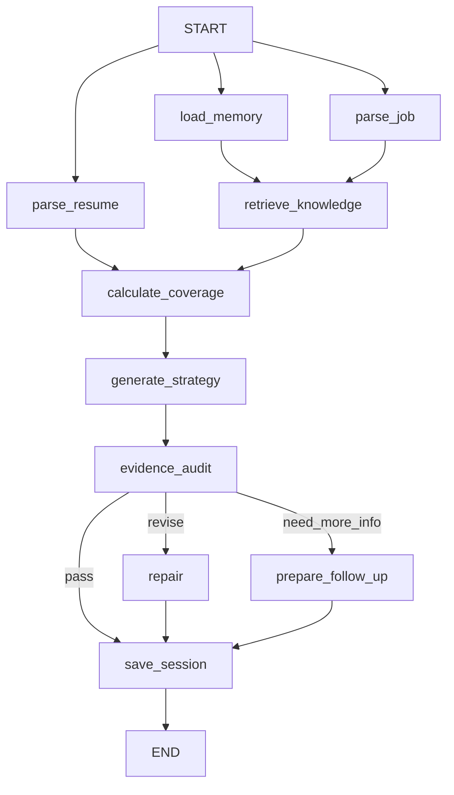

# AIMatch Agent

[](https://github.com/Arbiter1234/aimatch-agent/actions/workflows/ci.yml)

一个面向求职准备的 **LangGraph + RAG + Memory** 开源原型。输入简历与 JD，输出证据映射、差距、行动计划、面试问题及参考知识建议。

- `/`：公开作品展示，合成样例，不调用模型。
- `/lab`：私有工作台，管理知识、偏好及会话摘要，调用真实模型。
- 默认关闭私有 API；需显式启用并提供口令。
- 自动化测试使用模拟模型响应；**真实 API 效果、RAG 质量与用户收益仍待验证**。

## 技术栈

| 层级     | 实现                                               | 源码                               |
| -------- | -------------------------------------------------- | ---------------------------------- |
| 页面     | React 19、TypeScript、App Router / vinext + Vite   | `app/page.tsx`、`app/lab/page.tsx` |
| 编排     | LangGraph StateGraph、共享状态、并行及条件边       | `lib/agent/engine.ts`              |
| 模型     | OpenAI Responses API、严格 JSON Schema             | `lib/agent/engine.ts`              |
| RAG      | 分块、Embeddings、余弦相似度、引用 ID 校验         | `lib/rag.ts`                       |
| Memory   | 用户偏好与可选会话摘要，带来源标签                 | `lib/storage.ts`                   |
| 存储     | Cloudflare D1；本地 Miniflare SQLite；Drizzle 迁移 | `db/`、`drizzle/`                  |
| 访问控制 | 服务端开关、Bearer 口令、同源与输入检查            | `lib/private-api.ts`               |
| 测试     | Node test runner、真实图执行、模拟模型、SQLite     | `tests/agent.test.ts`              |

使用 **LangGraph JS/TS**，不是 Python。依赖 LangChain Core，但未用顶层 `langchain` Chain 拼接模型；模型通过直接 API 调用与图编排解耦。

## 执行流程



共 10 个注册节点，每次只走一个审计分支。检索等待 JD 和记忆就绪，覆盖率等待简历与检索都完成。

- 最多修订一次；修订后不再次审计，不能宣称问题全部消除。
- 追问返回用户补充材料后重新运行，未实现 interrupt/checkpointer 断点续跑。
- 这是固定业务目标下的工作流 Agent，不是自主选择任意工具的通用自治 Agent。

## RAG

1. 导入 TXT/Markdown 或粘贴正文，来源网址仅作为标签，不抓取网页。
2. 每块 700 字符，重叠 100 字符；生成 512 维 Embedding。
3. 正文、来源、模型名与向量写入 D1。
4. 根据岗位名称、要求与关键词查询；余弦相似度 >= 0.25，取前 4 块。
5. 检索片段传入策略、审计和修订节点；知识建议附片段 ID。
6. 服务端拒绝不存在的引用 ID，无命中时不伪造引用。

默认 `text-embedding-3-small`，更换模型需删除旧资料并重新导入。分块与阈值是未调优的原型初值。
最多 200 块，全量余弦扫描；没有混合检索、重排序、大规模向量索引、知识 PDF/OCR 或自动网页同步。
先使用合成教材 `knowledge/ai-product-demo.md`。

**知识仅辅助方法建议，不是候选人经历证据。引用存在不等于语义正确。**

## Memory

- 偏好：用户手动保存、编辑和删除的城市、方向、毕业时间等约束。
- 会话摘要：仅勾选后保存目标岗位、差距和下一步任务；标记“模型生成、未验证”。
- 不保存简历、PDF、JD 原文或完整报告，但模型派生摘要仍可能含个人信息。
- 每类保留最多 10 条，分析使用偏好和最近 3 条摘要，当前明确输入优先。
- 数据库存储可跨重启读取，不依赖浏览器 localStorage。
- 没有向量记忆召回、自动事实校验、冲突合并或 LangGraph 持久化检查点。

## 本地运行

推荐 Node.js 24，最低 22.13。源码可放 E/F 盘，在源码目录执行：

```powershell
git clone https://github.com/Arbiter1234/aimatch-agent.git
cd aimatch-agent
npm ci
Copy-Item .env.example .dev.vars
npm run db:local
npm run dev -- --host 127.0.0.1
```

已有源码直接进入目录，不必重复 clone。macOS/Linux 用 `cp .env.example .dev.vars`。
工作台地址：http://localhost:3000/lab 。

本地 Worker 使用 **`.dev.vars`**，修改后停止并重启 dev 服务：

```dotenv
PUBLIC_SHOWCASE_MODE=false
OPENAI_API_KEY=你的模型API密钥
OPENAI_MODEL=有权限且支持Responses及严格结构化输出的模型名
OPENAI_EMBEDDING_MODEL=text-embedding-3-small
AIMATCH_ACCESS_TOKEN=随机生成的工作台口令
```

生成随机口令：

```bash
node -e "console.log(require('node:crypto').randomBytes(24).toString('hex'))"
```

浏览器只填工作台口令，**不填模型 API Key**。勿把秘密放入 Vite/Worker 配置或 `VITE_` 变量。
PDF 输入还要求模型支持 PDF；密钥有效、权限、额度、网络都正常后才可能成功。
不要将开发端口暴露到公网。

### 首次真实测试

1. 工作台输入口令连接；没有模型密钥也可测试偏好的增删改查。
2. 导入合成知识教材，检查分块数量与 Embedding Token。
3. 保存偏好，粘贴合成简历和 JD，运行分析。
4. 检查报告、执行轨迹、引用片段及读取记忆数量。
5. 勾选摘要记忆再运行；刷新、重启后确认摘要存在，下次读取数量增加。
6. 测试编辑偏好、删除资料、无关查询及不勾选摘要。
7. 最后测试 PDF、无效密钥、网络错误与模型拒绝，人工核对事实。

生成和 Embedding 都消耗 API 额度；知识为空时跳过 Embedding 检索。
`store: false` 不等于服务商零留存。真实材料使用前阅读 [SECURITY.md](SECURITY.md)。

### 避免开发数据写入 C 盘

数据库、构建和测试数据保存在项目内 `.wrangler/`、`dist/`、`outputs/`，不提交 Git。
若同时控制 npm 缓存与临时文件，在当前 PowerShell 设置：

```powershell
New-Item -ItemType Directory -Force F:\CodexProjects\.npm-cache, F:\CodexProjects\temp | Out-Null
$env:npm_config_cache = "F:\CodexProjects\.npm-cache"
$env:TEMP = "F:\CodexProjects\temp"
$env:TMP = $env:TEMP
```

这不迁移已在 C 盘的 Node/Codex，也不控制操作系统或 Codex 自身日志。

## 验证与评测

```bash
npm run typecheck
npm run lint
npm test
npm run db:local
npm run build
```

9 项自动化测试覆盖三种图路由、引用校验、Token 累加、RAG 检索删除、
Memory 跨 SQLite 连接持久化、owner 隔离、模式/口令/输入校验及请求环境隔离。
**模型和 Embedding 响应均模拟，不需要密钥，不代表真实模型效果。**

配置真实密钥并启动私有服务后，在另一个终端运行：

```bash
npm run eval:smoke
npm run eval:agent
npm run eval:agent -- --limit=3
```

脚本优先读取 `.dev.vars`，旧版 `.env.local` 仅作后备。
默认 localhost:3000；`AIMATCH_BASE_URL` 可设为你自己受控的服务。
8 个合成案例分数区间是人工回归预期，不是招聘评分真值，也不是 RAG 效果评测。
RAG/Memory 的真实对照实验见 [评测清单](docs/EVALUATION.md)。不预置或伪造真实测试结果。

## GitHub 与部署

MIT 许可，第三方依赖遵循各自许可。GitHub 存源码，**不自动运行 Worker 或提供模型额度**。
上传 GitHub 不等于更新旧的线上展示站。

保留 Sites/Cloudflare 构建适配；开源副本 `.openai/hosting.json` 移除原站 project_id，
本地仍可运行。部署需你自己的平台项目、D1、服务端密钥和数据库迁移。
公网作品页应保持 `PUBLIC_SHOWCASE_MODE=true`。当前不具备多租户登录、限流和计费。

## 参考

- [LangGraph JS](https://docs.langchain.com/oss/javascript/langgraph/overview)
- [LangGraph Memory](https://docs.langchain.com/oss/javascript/langgraph/add-memory)
- [OpenAI Embeddings](https://developers.openai.com/api/docs/guides/embeddings)
- [Cloudflare 本地 secrets](https://developers.cloudflare.com/workers/configuration/secrets/)
